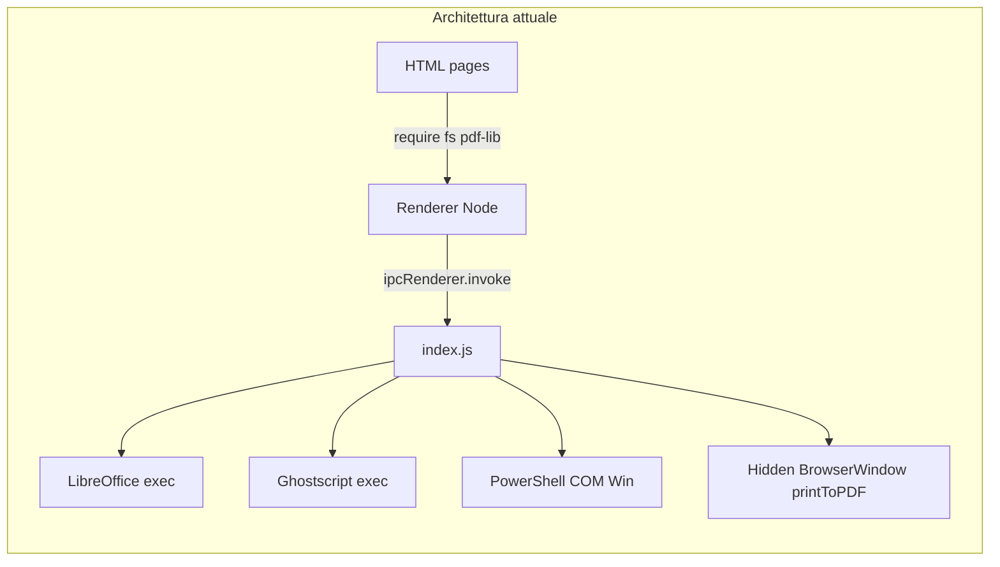
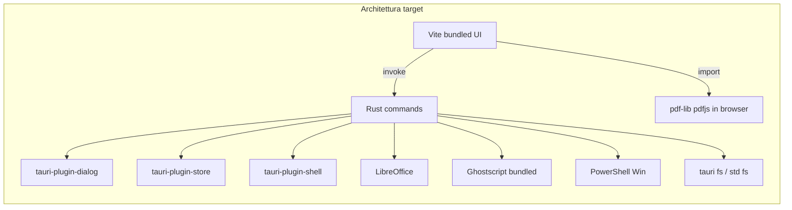

# Piano migrazione Pdeffy: Electron → Tauri 2

> Branch di lavoro: `feat/tauri-migration`  
> Strategia: **cutover** (sostituzione Electron in un unico rilascio)  
> Riferimento: [Tauri 2](https://tauri.app/)

## Checklist

- [ ] Fase 1 — Scaffold Tauri 2 + Vite multi-page
- [ ] Fase 2 — Platform bridge (sostituisce ipcRenderer)
- [ ] Fase 3 — Port Rust del backend (da index.js)
- [ ] Fase 4 — Casi speciali (Markdown PDF, PDF Editor, menu, DevTools)
- [ ] Fase 5 — Packaging, risorse, CI
- [ ] Fase 6 — Test di regressione cross-platform

---

## Stato attuale

Pdeffy è un'app **multi-pagina HTML/JS** senza bundler, con:

- **Main process monolitico** in `index.js` (~1500 righe): dialog, settings JSON, auto-update, LibreOffice/Ghostscript/MS Office, `printToPDF` per Markdown, conversione PDF→Excel nativa.
- **Renderer con Node abilitato** (`nodeIntegration: true`, `contextIsolation: false`): ~25 file in `functionalities/` usano `require('electron')`, `require('fs')`, `require('pdf-lib')` direttamente.
- **Packaging** via Electron Forge (`forge.config.js`): Squirrel (Win), DMG (macOS), deb/rpm (Linux), Ghostscript bundled su Windows in `resources/ghostscript/win`.
- **CI** GitHub Actions (`.github/workflows/build.yml`) con `npm run make`.



## Architettura target (Tauri 2)

Tauri usa il **webview nativo del SO** + backend **Rust**. Il frontend non può usare Node/`require` nel webview.



## Strategia: cutover

Un branch dedicato (`feat/tauri-migration`) con **un unico rilascio** che sostituisce Electron. Sei fasi sequenziali nello stesso branch, senza doppia manutenzione Electron+Tauri.

---

## Fase 1 — Scaffold Tauri 2 + Vite

1. Inizializzare Tauri 2 nel repo (cartella `src-tauri/`):
   - `tauri.conf.json`: `devUrl` / `frontendDist`, finestra maximized, icona da `assets/icon`, bundle identifier `com.reindal.pdeffy`.
   - Includere risorse Windows Ghostscript come `resources` (equivalente di `extraResource` in Forge).

2. Aggiungere **Vite** come build frontend:
   - Input multi-page: `index.html` + tutte le pagine in `functionalities/**/*.html`.
   - Output in `dist/` referenziato da Tauri.
   - Alias npm per librerie già in `package.json`: `pdf-lib`, `pdfjs-dist`, `jspdf`, `jszip`, `pptxgenjs`, ecc.

3. Aggiornare script in `package.json`:
   - `dev`: `tauri dev`
   - `build`: `tauri build`
   - Rimuovere `@electron-forge/*`, `electron`, `update-electron-app`, `electron-squirrel-startup`.

---

## Fase 2 — Platform bridge (sostituisce ipcRenderer)

Creare un modulo unico, es. `src/platform/bridge.js`, che espone la stessa API semantica usata oggi dai tool:

| API attuale (Electron) | Nuova implementazione |
|---|---|
| `ipcRenderer.invoke('show-save-dialog', opts)` | `@tauri-apps/plugin-dialog` `save()` |
| `ipcRenderer.invoke('get-downloads-path')` | `path.downloadDir()` da `@tauri-apps/api/path` |
| `ipcRenderer.invoke('get/save-pdf-metadata')` | `tauri-plugin-store` o command Rust |
| `ipcRenderer.invoke('get/save-language')` | idem |
| `ipcRenderer.invoke('check-first-launch')` | command Rust (marker file in app data) |
| `ipcRenderer.invoke('convert-with-libreoffice', …)` | command Rust |
| `ipcRenderer.invoke('compress/protect-with-ghostscript', …)` | command Rust |
| `ipcRenderer.invoke('check-engines-availability')` | command Rust |
| `ipcRenderer.invoke('check-ghostscript-availability')` | command Rust |
| `ipcRenderer.invoke('markdown-file-to-pdf', …)` | command Rust o frontend jsPDF (vedi Fase 4) |
| `ipcRenderer.invoke('generate-pptx', …)` | frontend `pptxgenjs` + `writeFile` via Rust |
| `ipcRenderer.invoke('open-external-url')` | `@tauri-apps/plugin-opener` |
| `ipcRenderer.invoke('open-file'/'open-folder')` | plugin opener / shell |

Aggiornare in batch:

- `changeLang.js`, `settings.js`
- Tutti i file in `functionalities/**/*.js` (~25 file con `require('electron')`)

Pattern di migrazione renderer:

```javascript
// prima
const fs = require('fs').promises;
await fs.writeFile(savePath, pdfBytes);

// dopo
import { writeFile } from '@tauri-apps/plugin-fs';
await writeFile(savePath, pdfBytes);
```

Per i PDF già in memoria (`ArrayBuffer`/`Uint8Array`), la maggior parte della logica `pdf-lib` resta nel frontend; cambia solo **persistenza su disco** e **dialoghi**.

---

## Fase 3 — Port Rust del backend (da index.js)

Suddividere `index.js` in moduli Rust sotto `src-tauri/src/commands/`:

| Modulo Rust | Contenuto portato da index.js |
|---|---|
| `settings.rs` | `pdf-settings.json`, `language-settings.json`, `warnings-settings.json`, first-launch marker |
| `dialog.rs` | save/open dialog wrappers |
| `libreoffice.rs` | `getSystemLibreOfficePath`, `convert-with-libreoffice` (incluso 2-step PDF→ODT→DOCX, infilter PPTX, metadata OpenXML) |
| `msoffice.rs` | `convertWithMSOfficeWindows` (solo Win, PowerShell COM) |
| `pdf_excel.rs` | pipeline `pdf2json` + `xlsx` — valutare port JS→Rust o logica JS lato frontend |
| `ghostscript.rs` | `getGhostscriptPath`, compress, protect AES |
| `engines.rs` | check LibreOffice / MS Office / Ghostscript |

**Plugin Tauri da abilitare:**

- `tauri-plugin-dialog`
- `tauri-plugin-shell` (exec LibreOffice/Ghostscript con argomenti controllati)
- `tauri-plugin-fs` (scope limitato a Downloads + path scelti dall'utente)
- `tauri-plugin-store` (settings)
- `tauri-plugin-opener`
- `tauri-plugin-updater` (sostituisce `update-electron-app`)

**Capabilities / security:** definire allowlist comandi shell (`soffice`, `gs`, `powershell.exe`) e permessi fs minimi in `capabilities/default.json` (Tauri 2 ACL).

---

## Fase 4 — Casi speciali

### 4a. Markdown / HTML → PDF

Oggi: `printHtmlStringToPdf` in `index.js` con `BrowserWindow.printToPDF`.

Opzioni cutover (in ordine di preferenza):

1. **Frontend**: `marked` + `jspdf`/`html2canvas` (già dipendenze) — niente finestra nascosta.
2. **Rust**: crate tipo `headless_chrome` / servizio esterno — più pesante.

Consiglio: **opzione 1** per ridurre dipendenza da API Chromium.

### 4b. PDF Editor unified

`functionalities/pdfEditor/` usa `fs`, `ipcRenderer`, `require('pdf-lib')` in export modules.

- Bundlare `pdf-lib` via Vite (sostituire `require('pdf-lib')` in `applyAnnotations.js`, `buildPdf.js`).
- Export: `writeFile` via Tauri dopo save dialog.
- `pdfjs` worker path: servire da `dist` con path assoluti Vite.

### 4c. Menu nativo + About

Sostituire `Menu.setApplicationMenu` con Tauri menu in `tauri.conf.json` / Rust `MenuBuilder`, oppure menu in-app minimal (già presente header con back link).

### 4d. DevTools

Shortcut Ctrl+Shift+I: abilitare solo in debug build (`#[cfg(debug_assertions)]`).

---

## Fase 5 — Packaging, risorse, CI

1. **Risorse bundled:**
   - Ghostscript Windows → `src-tauri/resources/ghostscript/win/` (come oggi).
   - Risolvere path runtime con `tauri::path::resource_dir()`.

2. **Target build:**
   - Windows: NSIS o WiX (Tauri default) — sostituisce Squirrel `.exe` + `.nupkg`.
   - macOS: `.dmg` / `.app`.
   - Linux: `.deb` + AppImage (Tauri supporta entrambi).

3. **Aggiornare CI** `.github/workflows/build.yml`:
   - Install Rust stable + dipendenze Linux (`libwebkit2gtk`, `libappindicator`, …).
   - `npm ci && npm run tauri build`.
   - Upload artefatti `.exe`, `.dmg`, `.deb`.
   - **Updater:** migrare release `latest` a formato Tauri updater (firma, manifest JSON) — il flusso `.nupkg`/`RELEASES` Squirrel non si applica più.

4. **Rimuovere:** `index.js`, `forge.config.js`, dipendenze Electron.

---

## Fase 6 — Test di regressione

| Area | Test |
|---|---|
| Dialog save/open | ogni tool che esporta PDF |
| Settings / i18n | author/title/subject, 4 lingue, first launch |
| Conversioni LO | docx/xlsx/pptx→pdf, pdf→docx/pptx |
| PDF→Excel | algoritmo nativo JS |
| Ghostscript | compress + protect |
| MS Office fallback | solo Windows, se installato |
| PDF Editor | load, watermark, redact flatten export, signature, search |
| Updater | check download su Win/macOS |

---

## Stima effort (cutover)

| Fase | Effort indicativo |
|---|---|
| Scaffold Tauri + Vite multi-page | 2–3 giorni |
| Platform bridge + migrazione renderer | 4–6 giorni |
| Port Rust conversioni/settings | 5–8 giorni |
| Markdown PDF + edge cases | 1–2 giorni |
| CI/updater/packaging | 2–3 giorni |
| QA cross-platform | 3–5 giorni |
| **Totale** | **~3–4 settimane** |

---

## Rischi principali

1. **`require()` diffuso nel renderer** — senza Vite la migrazione fallisce; Vite multi-page è obbligatorio.
2. **Permessi fs Tauri** — ogni scrittura fuori da path utente va passata per dialog + scope esplicito.
3. **LibreOffice su Linux Snap** — mantenere workaround profilo isolato (già in index.js) nel port Rust.
4. **Updater** — cambio formato release; utenti Electron non ricevono update automatico verso Tauri (comunicare reinstallazione major).
5. **Dimensione bundle vs Electron** — vantaggio Tauri (~600KB base) ma Ghostscript bundled resta pesante su Windows.

---

## Deliverable finali del cutover

- App avviabile con `npm run tauri dev` / `npm run tauri build`
- Nessun riferimento a `electron`, `ipcRenderer`, `require('fs')` nel frontend
- `index.js` e Forge rimossi
- CI verde su macOS, Windows, Ubuntu
- Documentazione breve in README: prerequisiti (LibreOffice opzionale, Ghostscript su macOS/Linux)
